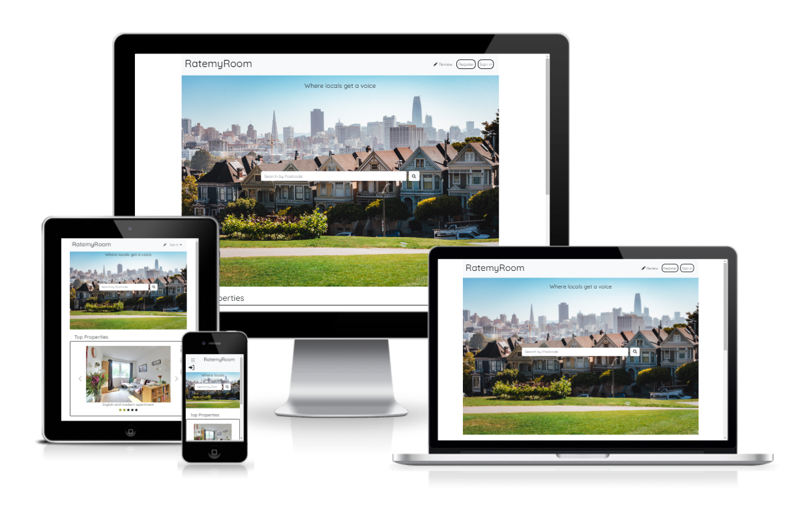
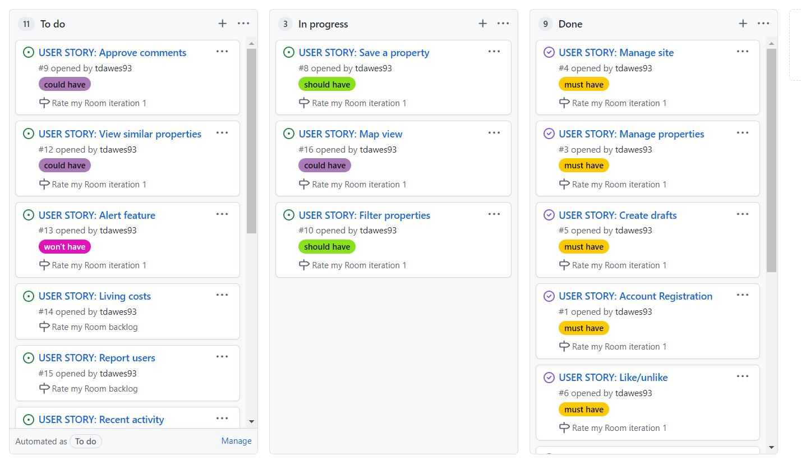
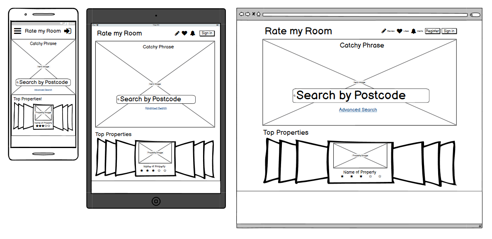
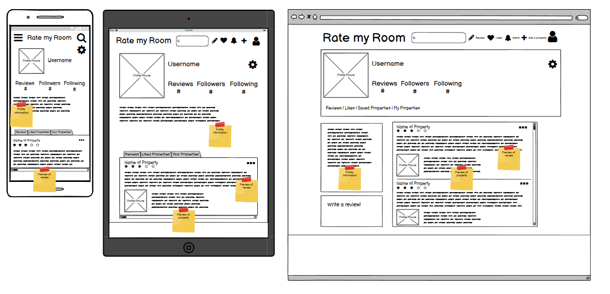

Future things to add/change

JS script could be condensed. Need to figure out way to not repeat code for each set of star ratings

Test Problems
changed assertTrue test to assertLessEquals

Needed to create user and property instances to get review unittests to work 

Repetative code for displaying star ratings on property.html, solution was to use Django's built in  tags. Similar to extend, allowed variables to be used across the two templates.

Carousel on index.html was pulling all property data entries and laying them ontop of one another. Fix was made using an if loop to ensure the only first property of the for loop was displayed until the carousel nav buttons were used 

UserPassesTestMixin not working correctly and allowing users whose role is a tenant to add properties

Manual User testing:

registration doesn't sign people in automatically 

Ratings not capped at 5

Styling issues on phone

w3c validator had 3 fails empty href. other errors aer django tempalte tags

Jigsaw passed no errors

add review bug: 

code that fixed by:     def get_context_data(self, *args, **kwargs):
        context = super().get_context_data(**kwargs)
        slug = self.request.GET.get("slug")
        queryset = Property.objects.filter(status=1)
        property = get_object_or_404(queryset, slug=slug)
        context['property'] = property
        return context

Raised new error regarding slug already defined. removed slug from reviews model

migration bug:
removed and uninstalled django-address, this messed up this dependancies in the migrations, attempted to fix by removing migrations. Easiest solution in the end was to duplicate the properties app, delete the old one, delete all migrations and migrate again. 

superuser password:
tdawes93
Casa2793

References:
Carousel code https://getbootstrap.com/docs/5.2/components/carousel/
Teaser code https://github.com/rmosolgo/bootstrap-teaser
Star code https://www.youtube.com/watch?v=AXwuF1C-Bso&ab_channel=Pyplane

# RatemyRoom
RatemyRoom is a website similar in fashion to TripAdvisor or Yelp, however it allows the user to provide feedback and reviews on rental properties they have lived in. As generation rent grows the number of poor landlords taking advantage also increase. The website idea came from the need to have a space for tenants to be able to voice their opinion on rental;, to provide local knowledge on the area, condition of the property and most importantly the quality of the landlord. The website also provides a space for the landlords to advertise and have some good publicity!

This app was made as to the fulfilment of the Milestone Project 4 for the Full-Stack Software Development Course provided by Code Institute. It is a Full Stack project and deployed on Heroku using Code Institue's mock terminal.

The live website can be found [here](https://rate-my-room.herokuapp.com/)

## Table of Contents

- [Goals](#Goals)
- [User Experience](#UX)
    - [User Goals](#User-Goals)
    - [Project Flow and Processes](#Project-Flow-and-Processes)
    - [Limitations](#Limitations)
- [Features](#Features)
    - [Future Features](#Future-Features-to-Implement)
- [Technologies](#Technologies)
    - [Languages](#Languages)
    - [Tools](#Tools)
- [Testing](#Testing)
    - [Overview](#Overview)
    - [Validator Testing](#Validator-Testing)
    - [Issues/Bugs Resolved During Testing](#Issues/Bugs-Resolved-During-Testing)
    - [Testing User Goals](#Testing-User-Goals)
- [Deployment](#Deployment)
- [Credits](#Credits)
- [Acknowledgments](#Acknowledgments)

****

## Goals

RatemyRoom App is designed to help improve the quality of rentals as well as reducing the number of tenancy agreements that end badly! With that in mind the website was designed to provide an unbiased platform for everyone to have their say. The app is split into two main user permission groups, tenant and Landlord/Estate Agent. Their features are as below:

### Tenant

- Create a user profile, edit user details and delete the profile
- Search for properties either using the search bar or by scrolling through the carousel
- View each properties individual details, e.g. address, number of rooms, overall rating 
- Read other people's reviews and like individual properties
- Write a review on properties, leaving a 5 star rating on five individual categories
- Edit and delete any reviews they have written
- See a list of review titles they have written and when they were posted

### Landlord/Estate Agent

In addition to all the features found in the Tenant User Profile the Landlord/Estate Agent User Profile has access to:
- Create a proptery post, indicating key information e.g. if it is for rent. 
- Edit and delete any properties they have posted
- See a list of property names they have posted

Users who have no created a profile an are therefore no authenticated can still:
- See a list of properties in the carousel
- View individual property information
- Read reviews on each property
- Search for properties using address information

It is encourage all users create a profile, even those just viewing the site as additional features that may be of interest to them could be added in further releases.

***

## UX

### Agile Developement

This project was built following an Agile design approach. As there is no client following an agile approach had to be adjusted slightly, with the principles focussing on simplicity, promoting sustainable development, delivering working software and reflecting on continuous improvement prioritised. The agile values of 'Working Software' and 'Responding to Change' were at the forefront of the design. This release can be considered to be the first release phase. 

#### User Stories

- Site User:

    - As a site user I can register an account so that I can add a property, review a property, like and comment on a review
    - As a site user I can click on a property so that I can read/see the full details
    - As a site user I can open a review so that I can see what other people have said about the property
    - As a site user I can report other users for a breach of site rules so that I can keep the site respectful and functional
    - As a site user I can see recent activity so that I can be kept up to date with user interaction
    -As a site user I can have a ranking attached to my profile so that other users can see how reputable my properties/reviews are
    - As a site user I can message other users directly so that I can ask questions about properties without filling up the comments section

- Tenant User
  - As a tenant I can filter properties by different criteria so that I can find properties that interest me
  - As a tenant I can like or unlike a property so that I can interact with the content
  - As a tenant I can leave a review and rate a property so that I can post my opinion on the property
  - As a tenant I can search for properties by keywords so that I can find specific properties
  - As a tenant I can save/favourite a property so that I can find it later
  - As a tenant I can view a map with all the properties so that I can see all the properties in my desired area
  - As a tenant I can have a mood board/activities board so that I can see all my comments, liked and review properties
  - As a tenant I can log in using my pre-existing Google/Facebook logins so that I can integrate all my accounts

- Landlord & Estate Agent User
  - As a landlord/estate Agent I can create, read, update and delete my properties so that I can manage my property content
  - As a landlord/estate Agent I can create drafts for properties so that I can finish writing the content later
  - As a landlord/estate agent I can reply to reviews left on my properties so that I can explain/challenge any unfair reviews

- Site Admin User
  - As a site admin I can create, read, update and delete all properties so that I can manage the content of the entire site

As part of my agile development I assigned my user stories to a backlog, before bringing some across to my first iteration with a due date of 30th June 2022. These issues were then assigned MoSoCoW prioritization with 52% of the user stories being Must Haves. The agile plan can be viewed [here](https://github.com/tdawes93/rate-my-room/projects/1). Due to the timeframe only the Must Have's were completed, the remaining Should, Could, and Won't have's will go back into the backlog, before creating iteration 2 and reprioritizing.

### Structure

### Design

#### Colour Scheme

- The three main colours used were Red #EF0001, White #FFFFFF and Oxford Blue #172030. These colours were taken from the Arsenal FC logo to ensure they are official Arsenal FC colours. This allows the site to be instantly identifiable by football fans. 

- The kick-off button is coloured in Metallic Sunburst #9D8349 and the background of the page is coloured in Cultured #F1F2F3. Both these colours are taken from the official Arsenal FC website and stick with the main theme.

#### Typography

- Source Sans Pro is used throughout the site. It is a sharp, clear and crisp font making it easy to read. It is similar to FF Meta which is the font used on the official Arsenal FC site.

- The site uses uppercase for titles and buttons and capitalisation for all other text. This enables readability and allows the buttons to be easily identified.  

- The font has a sans-serif backup.

#### Imagery

- The images were selected as they show famous moments in Arsenal's history. They were chosen to create excitement whilst being a trip down memory lane.

- The images have been resized to be responsive.

### Wireframes/Skeleton

##### Home Page

##### Collapsable Navbar

##### Profile Page

##### Add Property

##### Add Review

##### Property Detail

## Features

### Existing Features

#### Google Sheets
- The Google Sheet was set up to host all the historical data the restaurant had been using up until this point.
- The app will take data from this sheet and use it, in conjunction with new input data, to calculate the outputs (number of staff needed etc.)
- All data used within this app; input data, data from calculations and output data; will be stored in this Google Sheet. 
- The Google Sheet consists of four worksheets representing bookings, walk-ins, takings and the number of staff on shift. Each worksheet has seven columns, representing the days of the week, and each row represents a new week. 
- The bookings worksheet has an extra row, with all 0 as this is the starting point for each week where no bookings have been made yet. 

#### Main Menu
- The main menu welcomes the user to the app and asks them to select a choice of three options:
    - Enter a new booking
    - View the total number of bookings
    - Calculate staff numbers required for the upcoming week
- The user must answer using the numbers 1 to 3. If the input data is not a number the error 
> "Invalid data: invalid literal for int() with base 10" 

is raised.
- If the user inputs a number that is not 1 to 3 the error
> "Invalid data: Input must be 1, 2 or 3. Please try again" 

is raised. 
- The user is then asked to select again in both instances.

#### Make Booking
- Upon selecting option 1 the user is prompted to input a day of the week
- Again an error will be raised if the data is invalid.
- Once a valid input has been made the user will have to input the table size. This is limited between 1 and 10 (inclusive) to limit large tables without pre-ordering/deposits etc. This data is also validated
- Successful input of the day and party size will result in the terminal printing out a dictionary summarising the booking and a message asking if you wish to save your booking. 
- Should the user select "Y" the user will be told the booking is saved. The Google Sheet will be updated to add the party size to the last row and relevant column in the bookings worksheet. 
- If the user selects "N" no further action to the dictionary will be taken. Both choices are followed by the return the menu section, discussed later.  

#### View Bookings
- If the user selects option 2, a total of all bookings per day is displayed.
- This is displayed as a dictionary that has had its order fixed to follow the order the days of the week fall.
- If the user selects this option first or early on in their use it will display all 0 or mainly 0. This is because no or few bookings have been made and as more bookings are made this will fill up. 

#### Calculate Staff Needed
- If option 3 is chosen the user is met with a message explaining that calculating the number of staff resets the bookings for the following week and asks them if they have completed all their bookings.
- Again the input for this answer is validated with errors raised in the event of invalid data.
- If "N" is selected the user is taken back to the main menu and prompted to complete their bookings.
- If "Y" is selected the calculating staff function is run. 
- This function performs the following steps in order:
    - Calculate the average number of walk-ins over the last 10 weeks 
    - Iterates over the two lists adding the values together to create a "Total number of covers per day" list
    - Multiplies the total covers list by 15 for Monday to Thursday and by 25 for Friday to Sunday to calculate the predicted takings in pounds. 
    - Divides the predicted takings list by 400 to calculate the minimum number of staff required to work per day. 
    - If the number is only 1, an extra staff member is added.
    - If the day is Friday to Sunday and an extra staff member is added
    - This list is then used along with the days of the week to create a dictionary and printed to the terminal.
    

#### Return to Main Menu
- All choices are followed by an option to return to the main menu. 
- If "Y" is selected it will return the user to the main menu where they can select again from the three initial options.
- If "N" is selected the user is thanked for using the app and it ends. 

### Future Features to Implement
- The ability to input a time of booking, not just day and number of people, would allow the user to have greater knowledge on when tables are booked.
- In addition, each day could be split into three "services", breakfast, lunch and dinner. The app could then be updated to calculate the staff required for each service for each day, providing a more realistic overview of how a restaurant needs to schedule its staff. 
- Another feature to be added in the future is the ability to make bookings further in the future than the current week. This could be done by using a date function, or a week commencing function.
- Tieing into this the ability to view historical data/bookings/staff numbers without going to the Google Sheets would be useful to improve budgeting ability.
- The four features above, are one step in the road into developing this app into a full business management/CRM style app. This is where I envision this app developing in the future. 

***

## Technologies

### Languages
- The project was written using Python 3.8.11
-  The following modules and APIs were installed to improve the output and functionality:
    - Math - Used for the ceil() function to round numbers up to the nearest integer
    - Statistics - Used for the fmean() function to calculate the mean average and reduce the amount of code needed
    - Gspread - API for Google Sheets used to get and update the worksheet 
    - Google Auth - Authenticates Google's APIs and takes the credentials from the Google Sheets 

### Tools    
- Gitpod was used as an online IDE
- Github was used as the repository for the source code
- Heroku was used as the platform to run the deployed app
- Google Sheets was used to store the data and where the initial "historical data" was held
- Code Institute's Python Essentials Template was used to view the app in a mock terminal
- PEP8 checker was used to check the Python code for errors 

***

## Testing

### Overview

Testing will be performed on the functionality of the app. The ease of use and clarity will also be reviewed to ensure the back-end code integrates nicely with the front-end design. 

Testing will look for the following:

- The interaction and statements printed to the terminal are clear and easy to follow.
- All inputs are checked and validated to ensure the user does not input invalid data types. Errors will be raised and an opportunity to try again will be allowed following invalid data entry.
- No unexpected errors occur once deployed to Heroku and all errors raised are due to user input errors.
- The user is given the option to return to the main menu upon finishing their action for ease of use.
- All bookings made by the user are saved to the Google Sheet and then can be pulled up before calculating staff numbers.

### Validator Testing

- Python
    - The official PEP8 online syntax checker came back with no issues. 

     

### Issues/Bugs resolved during testing 

- Upon deployment, the dictionary showing the current weeks bookings that was printed to the terminal was difficult to read and spread over across two lines. This was resolved by installing the pprint() function to make it clearer in the terminal with each new key:value pairing printed on a new line.

- The fix above then created a new bug. In Python 3.8 + the print() function orders dictionaries in order of creation of key:value pairs. However, pprint() orders them alphabetically by key. This was solved by adding "sort_dicts=False" inside each pprint function.

- If the user selected "Y" to return to the main menu within function "restart()" and then selected "N" to end the app once "restart()" is run a second time, two identical print statements were returned in the format:
     > "Thank you for using the restaurant management app.
Thank you for using the restaurant management app"

    This was fixed by creating a new function "main_menu()" which only runs the "start()" function if the input variable is True.

- I originally had the inputs accepting data starting both with and without a capital letter (e.g. Monday or monday). This made for a large number of if statements within my try statements. I didn't wish to remove the ability to use lower case as it takes away from the user-friendliness of the app. To fix this I added the .capitalize() method to the end of all my input() functions, automatically Capitalizing the input, making them valid (provided the input is of the correct type).

### Testing User Goals

- The user goals listed in the User Goal section were tested to ensure the project outcomes were met and the app has good real-world use.  

1. To make a booking for a specific day and input the number of guests required for the booking.
    - Upon running the app select option 1 which allows the user to make a booking Monday - Sunday of up to 10 people
2. To save this booking and it to add to the total number of people booked in that day. 
    - Within option 1, the user has the option to save their booking, which adds the booking to the last row in the bookings worksheet
3. To view the total number of people booked in on any given day in the week.
    - Select option 2 in the main menu and a dictionary in the form {day: number of people booked} will be printed to the terminal for all days of the week
4. To be able to see how many staff are required for the number of people booked.
    - After running the app, select option 3 in the main menu. This choice will calculate the minimum number of staff required per day and print it in another dictionary in the form {day: number of staff needed}.
5. To be able to reset the bookings and start again each week.
    - Option 3 automatically resets the bookings back to 0 whilst calculating the number of staff needed. It gives the user the choice if they wish to proceed, in case it was pressed accidentally.
    - The user can then restart the app with a new week and input new bookings

***

## Deployment 

### Deploy to Heroku

Please deploy the app to Heroku using the following steps:

1. Log into Heroku and click the 'New' button and then "Create new app" from the drop-down list
2. Name your app (it must be unique) and select the region you are based in
3. Select settings and scroll down to the config vars section
4. Wi
5. Add another config var of PORT (key) 8000 (value) to ensure the mock terminal works.
6. S
7. In the connect to Github section, add the repository name to link the Github.
8. Press deploy to deploy the app to Heroku, you can also opt in to "Enable Automatic Deploys" which updates the Heroku every time a new change is pushed to Github.

### Fork the GitHub

If you wish to view or make changes without affecting the original repository you can 'fork the repository'. This creates a copy to your GitHub and can be done using the following steps:

1. Log in to Github and locate the [RatemyRoom Repository](https://github.com/tdawes93/rate-my-room)
2. At the top right of the repository underneath the notification icon is the 'fork' button
3. Click this button and you should now have a copy of the repository in your Github account

### Make a local clone

1. Log in to Github and locate the [RatemyRoom Repository](https://github.com/tdawes93/rate-my-room)
2. At the top of the repository next to the 'Gitpod' button click the dropdown named 'Code'
3. To clone the repository using HTTPS, make sure HTTPS is selected and copy the link
4. Open the Git Bash
5. Change the working directory to the location you wish the clone to be made
6. Type 'git clone' and paste the copied URL
7. Press 'Enter' and your local clone will be created

***

## Credits
- Inspiration
    - The idea for this app along with suggested future updates was borne from countless weeks having to estimate takings and staff numbers required whilst managing pubs

- Code
    - The update_worksheet function was taken from Code Institute's Love Sandwiches Mini Project

***

## Acknowledgments

I'd like to thank my mentor Spencer Bariball for his support and feedback throughout the project. 