Future things to add/change

Test Problems
changed assertTrue test to assertLessEquals

Needed to create user and property instances to get review unittests to work 

UserPassesTestMixin not working correctly and allowing users whose role is a tenant to add properties

Manual User testing:

superuser password:
tdawes93
Casa2793

References:
Carousel code https://getbootstrap.com/docs/5.2/components/carousel/
Teaser code https://github.com/rmosolgo/bootstrap-teaser
Star code https://www.youtube.com/watch?v=AXwuF1C-Bso&ab_channel=Pyplane

# RatemyRoom
RatemyRoom is a website similar in fashion to TripAdvisor or Yelp, however it allows the user to provide feedback and reviews on rental properties they have lived in. As generation rent grows the number of poor landlords taking advantage also increase. The website idea came from the need to have a space for tenants to be able to voice their opinion on rental;, to provide local knowledge on the area, condition of the property and most importantly the quality of the landlord. The website also provides a space for the landlords to advertise and have some good publicity!

This app was made as to the fulfilment of the Milestone Project 4 for the Full-Stack Software Development Course provided by Code Institute. It is a Full Stack project and deployed on Heroku using Code Institue's mock terminal.

The live website can be found [here](https://rate-my-room.herokuapp.com/)

## Table of Contents

- [Goals](#Goals)
- [User Experience](#UX)
    - [User Goals](#User-Goals)
    - [Project Flow and Processes](#Project-Flow-and-Processes)
    - [Limitations](#Limitations)
- [Features](#Features)
    - [Future Features](#Future-Features-to-Implement)
- [Technologies](#Technologies)
    - [Languages](#Languages)
    - [Tools](#Tools)
- [Testing](#Testing)
    - [Overview](#Overview)
    - [Validator Testing](#Validator-Testing)
    - [Issues/Bugs Resolved During Testing](#Issues/Bugs-Resolved-During-Testing)
    - [Testing User Goals](#Testing-User-Goals)
- [Deployment](#Deployment)
- [Credits](#Credits)
- [Acknowledgments](#Acknowledgments)

****

## Goals

RatemyRoom App is designed to help improve the quality of rentals as well as reducing the number of tenancy agreements that end badly! With that in mind the website was designed to provide an unbiased platform for everyone to have their say. The app is split into two main user permission groups, tenant and Landlord/Estate Agent. Their features are as below:

### Tenant

- Create a user profile, edit user details and delete the profile
- Search for properties either using the search bar or by scrolling through the carousel
- View each properties individual details, e.g. address, number of rooms, overall rating 
- Read other people's reviews and like individual properties
- Write a review on properties, leaving a 5 star rating on five individual categories
- Edit and delete any reviews they have written
- See a list of review titles they have written and when they were posted

### Landlord/Estate Agent

In addition to all the features found in the Tenant User Profile the Landlord/Estate Agent User Profile has access to:
- Create a proptery post, indicating key information e.g. if it is for rent. 
- Edit and delete any properties they have posted
- See a list of property names they have posted

Users who have no created a profile an are therefore no authenticated can still:
- See a list of properties in the carousel
- View individual property information
- Read reviews on each property
- Search for properties using address information

It is encourage all users create a profile, even those just viewing the site as additional features that may be of interest to them could be added in further releases.

***

## UX

### Agile Developement

This project was built following an Agile design approach. As there is no client following an agile approach had to be adjusted slightly, with the principles focussing on simplicity, promoting sustainable development, delivering working software and reflecting on continuous improvement prioritised. The agile values of 'Working Software' and 'Responding to Change' were at the forefront of the design. This release can be considered to be the first release phase. 

#### User Stories

- Site User:

    - As a site user I can register an account so that I can add a property, review a property, like and comment on a review
    - As a site user I can click on a property so that I can read/see the full details
    - As a site user I can open a review so that I can see what other people have said about the property
    - As a site user I can report other users for a breach of site rules so that I can keep the site respectful and functional
    - As a site user I can see recent activity so that I can be kept up to date with user interaction
    -As a site user I can have a ranking attached to my profile so that other users can see how reputable my properties/reviews are
    - As a site user I can message other users directly so that I can ask questions about properties without filling up the comments section

- Tenant User
  - As a tenant I can filter properties by different criteria so that I can find properties that interest me
  - As a tenant I can like or unlike a property so that I can interact with the content
  - As a tenant I can leave a review and rate a property so that I can post my opinion on the property
  - As a tenant I can search for properties by keywords so that I can find specific properties
  - As a tenant I can save/favourite a property so that I can find it later
  - As a tenant I can view a map with all the properties so that I can see all the properties in my desired area
  - As a tenant I can have a mood board/activities board so that I can see all my comments, liked and review properties
  - As a tenant I can log in using my pre-existing Google/Facebook logins so that I can integrate all my accounts

- Landlord & Estate Agent User
  - As a landlord/estate Agent I can create, read, update and delete my properties so that I can manage my property content
  - As a landlord/estate Agent I can create drafts for properties so that I can finish writing the content later
  - As a landlord/estate agent I can reply to reviews left on my properties so that I can explain/challenge any unfair reviews

- Site Admin User
  - As a site admin I can create, read, update and delete all properties so that I can manage the content of the entire site

As part of my agile development I assigned my user stories to a backlog, before bringing some across to my first iteration with a due date of 30th June 2022. These issues were then assigned MoSoCoW prioritization with 52% of the user stories being Must Haves. The agile plan can be viewed [here](https://github.com/tdawes93/rate-my-room/projects/1). Due to the timeframe only the Must Have's were completed, the remaining Should, Could, and Won't have's will go back into the backlog, before creating iteration 2 and reprioritizing.

## Structure

### Design

#### Colour Scheme

- The main body of the site is White #FFF this is due to the clarity of a white background. In addition due to large number and variety of images that can be uploaded by the user, white guarantees a lack of clash as much as possible.  

- The three other colours used are Citron #A5A640, Light Gray #D2CFCC and Eerie Black #171C1F. These were picked from the hero image which also represents a good representation of most real estate photography. Additional colours not used in this site but could be selected are Coloumba Blue #CBE4EC and Quick Silver #A8A4A5.

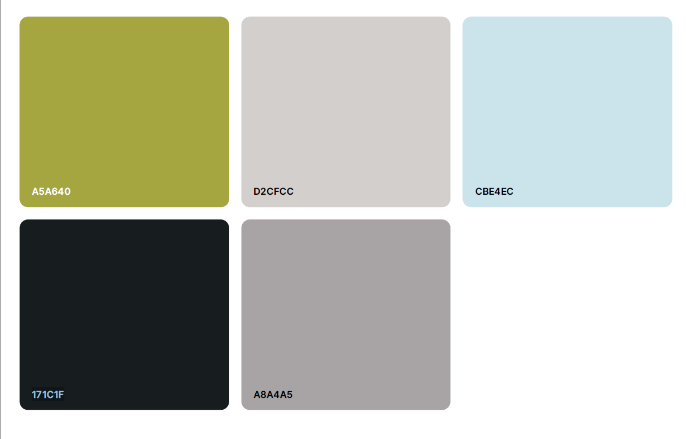

#### Typography

- Quicksand is used throughout the site. It is a display sans serif with rounded terminals. It uses geometric shapes as a core foundation creating an artistic yet professional view. It is used by sites in similar business areas like SpareRoom.co.uk

- The site uses sentance case throughout, with the logo being the three words of the name pushed together. This creates a feeling of togetherness and secuirty something that is also felt in a good home.

- The font has a sans-serif backup.

#### Imagery

- The images were selected as they show famous moments in Arsenal's history. They were chosen to create excitement whilst being a trip down memory lane.

- The images have been resized to be responsive.

### Skeleton

The final site consists of the following pages. Every page was written in HTML using Django Template Tags (written in Python).
Pages:
 - Homepage
 - Login
 - Register
 - Edit User
 - Add Property/edit property
 - Add Review/edit review
 - Search Property form
 - Search Property results
 - Property Details

#### Database Schema

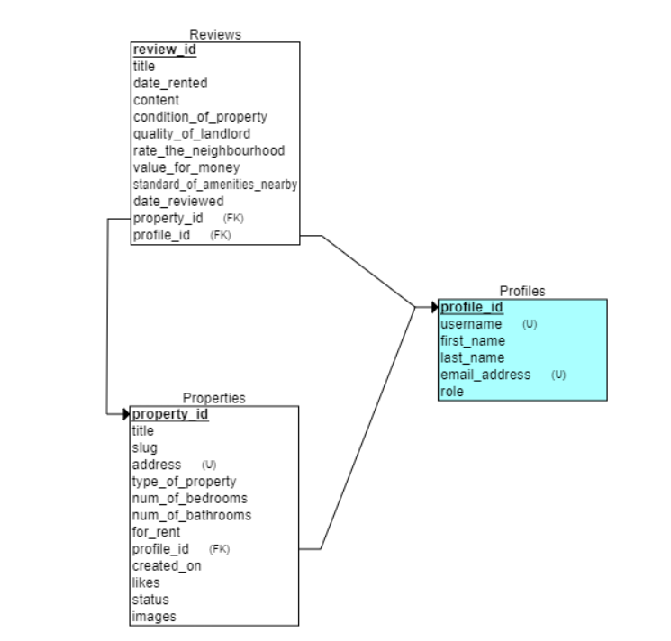

#### Wireframes

##### Home Page

##### Collapsable Navbar
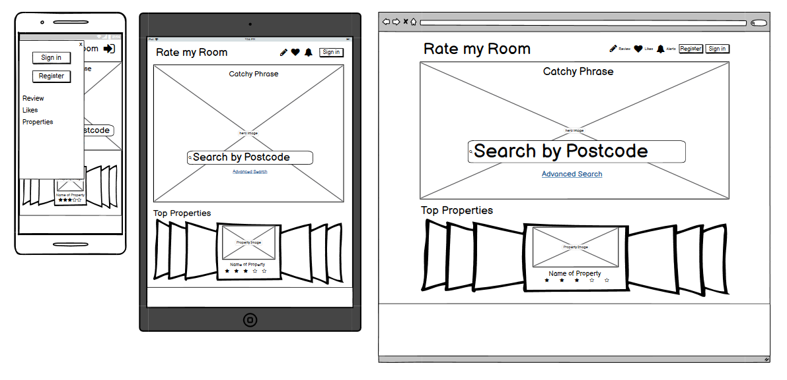

##### Profile Page

##### Add Property
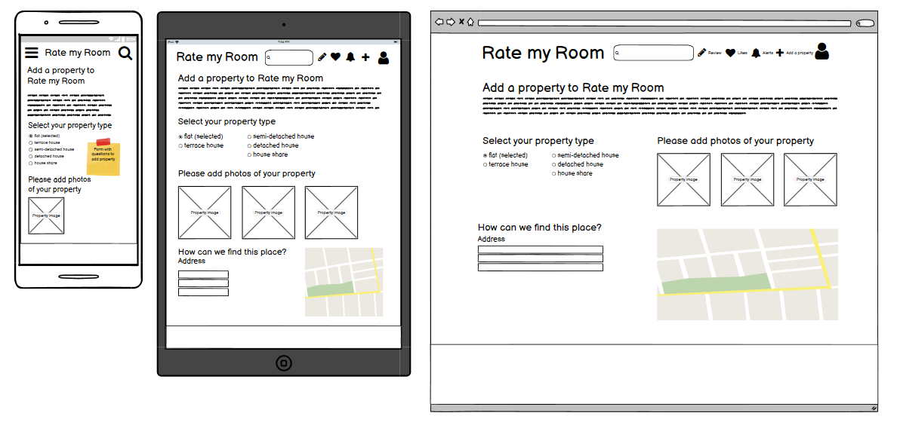

##### Add Review
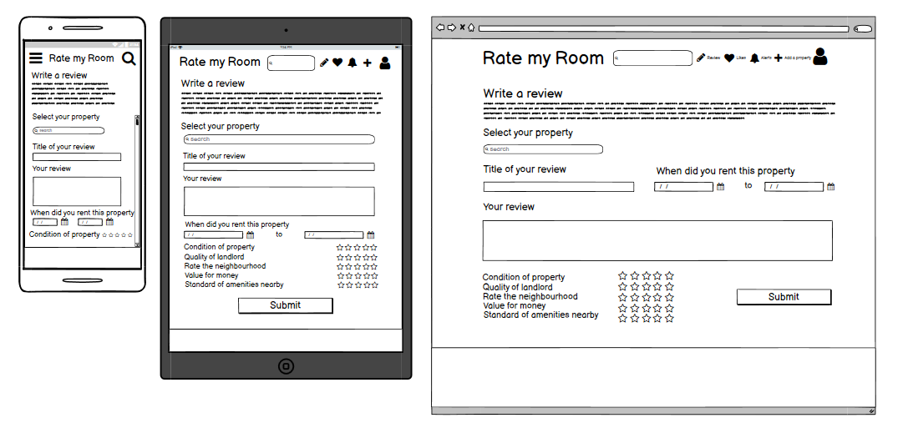

##### Property Detail
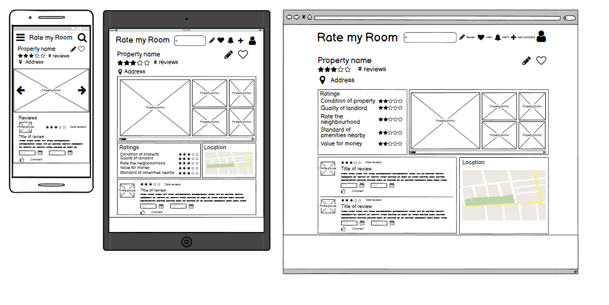

## Features

### Existing Features

#### Navbar/Footer
- Located at the top and bottom over every page on the site is the Navbar and Footer.
- The navbar provides a quick-link area for users to Sign-in, Write a review, Add a property etc.
- It is designed responsively using Bootstrap's Breakpoints.
- At smaller screen sizes the Navbar will collapse into a hamburger menu icon.
- At medium screen sizes only the icons that represent each function will show
- At larger screen sizes there will be a combination of icons, text and buttons. 
- The navbar will change depending on your logged in status and role selected upon registration, this is one of the methods used to restrict unautorised users from accessing pages they do not have permissions for.
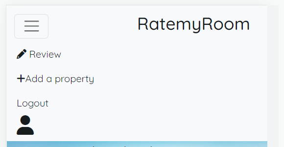

#### Hompage
- The Homepage was designed to be eye catching yet clear. It draws people in to two key areas.
- First the hero image and search bar:
    - The hero image shows both rurual and urban living instantly making it clear for the subject area of the site. 
    - Situated centre of this image is a search bar encouraging users to interact with the site
    - Both the hero image and search bar are fully responsive with the search bar increasing in size (proportionally to screen width) as the devices get smaller. This allows the search bar to maintain functionality as it is the key feature.
- Secondly the properties carousel
    - This carousel automatically scrolls through the properties providing an image, the property name and a star rating, representing the average rating provided by reviews.
    - If no reviews have been made on a property the star rating will be ommitted.
    - For larger devices the title and rating will appear if the user hovers, smaller devices have this information below the image.
    - The properties are currently in the order of date reviewed with the most recent first, in a future release this could be changed to be in rating order with the highest rated properties shown first.
    - Additionally each carousel item is a link, taking you to an extended detail page on the property (see [Property Detail](#Property-Detail))

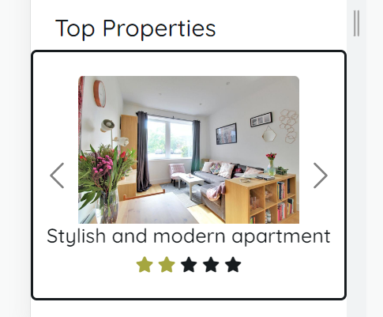
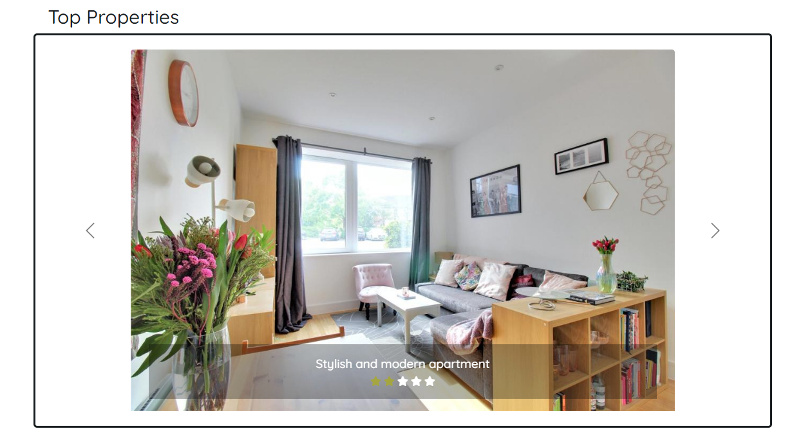

#### Property Detail
- The property detail page is one of the main pages of the site. It is accessible by all users including those that have not registered. 

- The first section shows a breakdown of the key property information including:
    - Property Title
    - Number of bedrooms
    - Number of bathrooms
    - Address
    - Main image
- If the property is for rent a button button indicating 'For Rent' will also pop up in this section. 
- One of the main drawing points to the property information is the average rating stars. This is calculated by taking the overall rating for each review made for the property an averaging it using the aggregate(Avg()) method built into Django. The result is then converted into an integer and the decimal places are removed using floatformat:0. The result is then transferred into a visual star form. 1 = One star filled in, 2 = Two stars etc.

- To the right of this details section is a series of buttons/links. The types and styles will change depending on if and who is logged in as. 
- Two icons visibile to all are the review icon (pencil) and the like icon (heart)
- Selecting the review icon will take you to the write a review form for this particular property, or if not logged in it will prompt you to login/register
- The heart will 'like' the property increasing the count by 1. If not logged in you will not be able to press this button.
- The other two buttons will only be visible if you are logged in as the owner of the property. These buttons are the edit and delete buttons.
- The edit button will take you to the same form as the 'add-property' form but with the information already filled in.
- The delete button will take you to a confirmation page. This provides an aspect of defensive programming which can be found across the entire site. Upon confirming deletion the property and any associated reviews will be removed from the database and website.

- Below the property image is the ratings a reviews section.
- On medium and large screen sizes the ratings card can be found directly below and to the left of the property info section, on smaller screen sizes this card is omitted. 
- The ratings section provides a breakdown of how the average rating used above is calculated. It shows the average score of 5 categories which users can rate the property when submitting their reviews. 
- The reviews card is broken up into individual reviews, which follow the same format for all screen sizes. 
- Each review displays the username of the user that left the review, the overall score given in the review, the content of the review and the dates the reviewer lived there. 
- In addition there are two CRUD functionality buttons, similar to those in the property info above. Only the user who wrote the review will be able to see these buttons. 
- The edit review button, brings the user back to the add-review page with the info already filled in.
- The delete review button takes you to a confirmation page as before. 

- Finally medium and large screen sizes have a location card on the property detail page. This card is currently blank as the user story was given a MoSoCoW ranking of 'Could Have' and was not completed in this iteration. This story will be placed back into the backlog and re-prioritised in subsequent releases. It was decided the location and card was going to be created to avoid design and layout issues in future. 

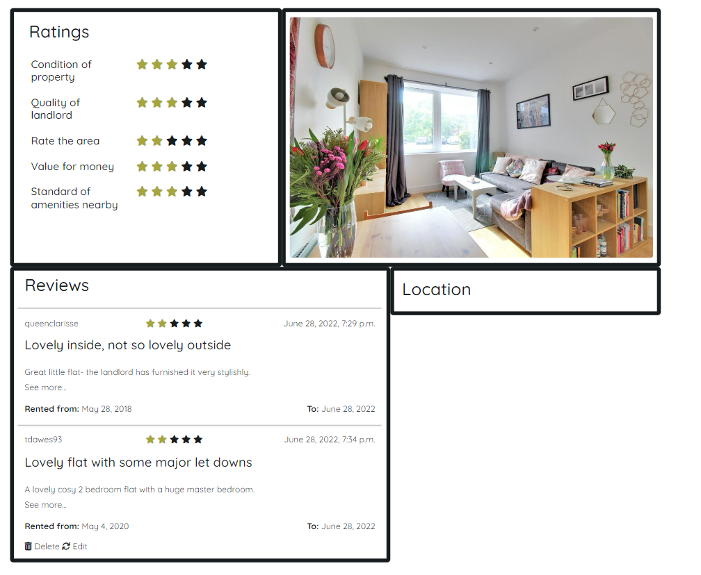
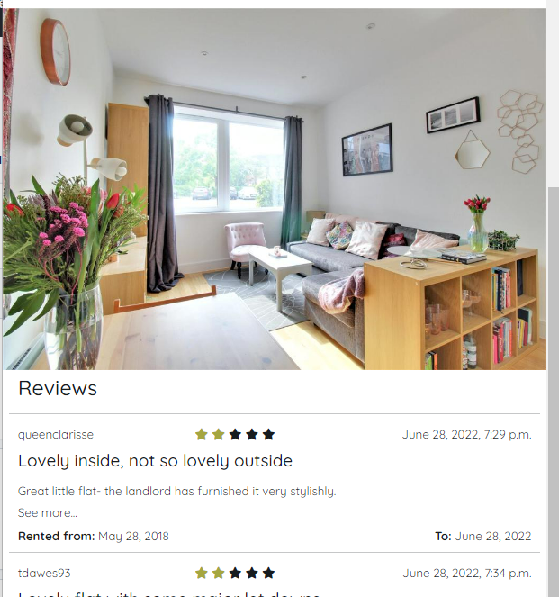

#### Add Property Page

- If the user is logged in as a Landlord or Estate Agent they will have access to the add property page. This can be accessed by the plus icon found in their navbar.
- This page brings up a form asking for the property details along with requesting an image. The user will also have an option to set the property as not published which will hide it from view.
- Once submitted the form will create a new entry in the Property table in the database and will then render a new page that can be accessed by all users.
- Logged in users can then leave reviews and like the property. 
- The edit property page renders the same form with the fields automatically populted. 

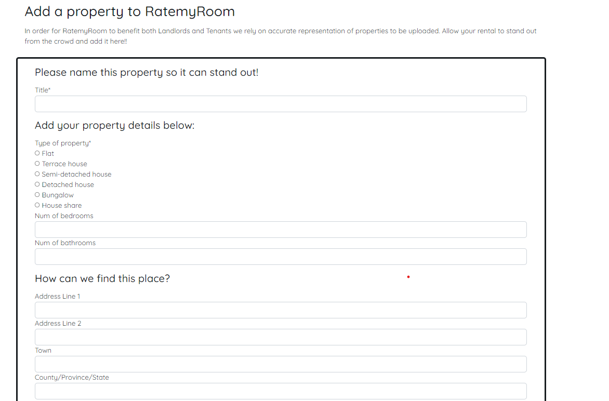

#### Add Review Page

- The add review page can be accessed by all users logged in.
- There are two ways to access the page. Users can either navigate to the property detail page of the property they wish to review and press the review (pencil) icon, or they can click the small review icon in the navbar where they will be prompted to search for the property using address information. 
- Both routes render the same page, which is a form requesting information about your review. The property information you are reviewing is displayed on the form to avoid confusion with rentals. 
- Upon submission the form will create a new entry in the Review table in the database and the review will be showed on the property detail page, in the reviews section. 
- Again there are edit and delete buttons that work in the same way as for the edit/delete property. 

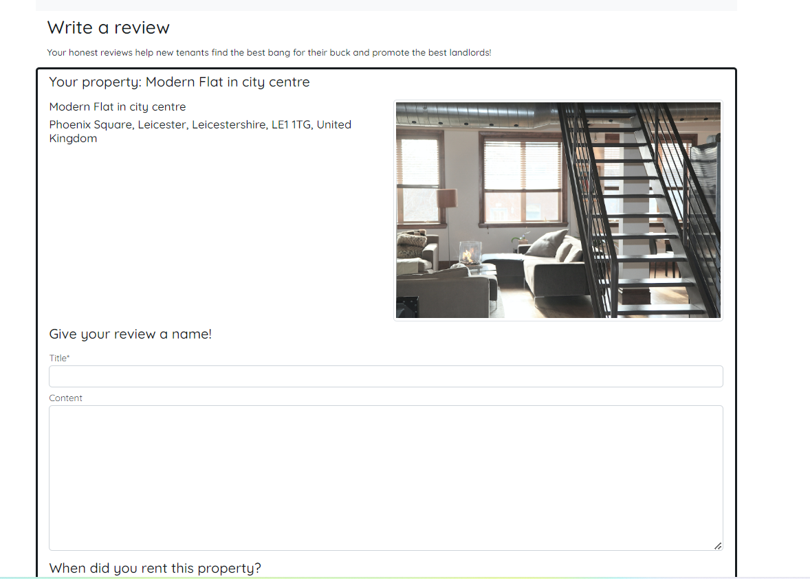

#### Register and login Page

- The register user and login pages render simple forms which can be accessed from the navbar for users that are not logged in.
- The pages can easily be navigated between the two incase the user presses the wrong link.
- Upon completion of the form the user will have succesfully created/logged in to provide access to permission required pages, such as add-review and add-property.
- The registration form is the same for both Tenants and Landlords/Estate Agents, with the role being selected on the form. 

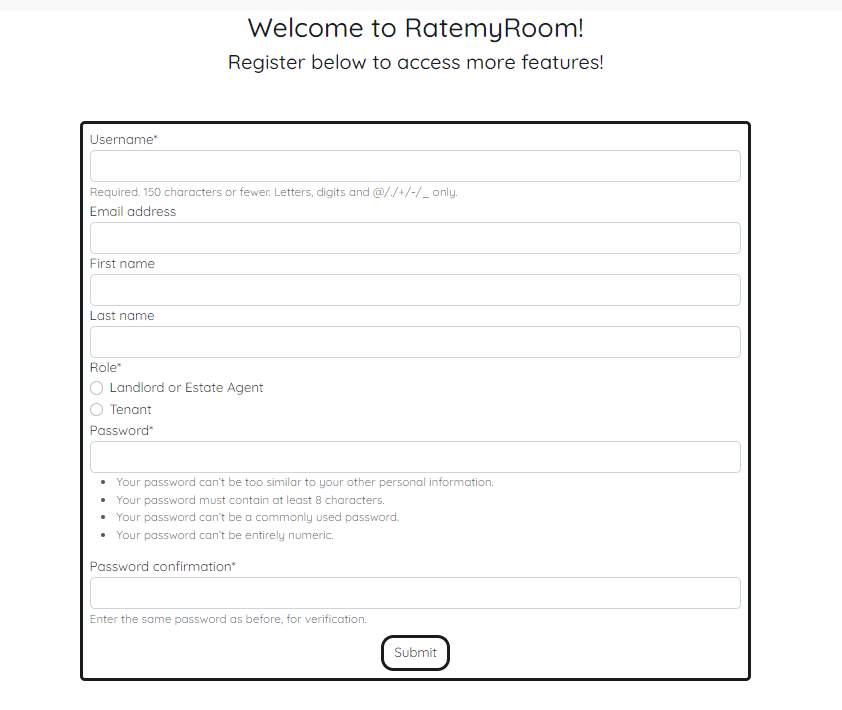

#### User Profile Page

- Once registered/logged in the user will have access to a profile page
- This page shows the users personal information followed by any properties or reviews they have posted
- In addition there is an edit profile form, where the user can change any personal information. 
- If they wish to change their password they are take to the secure built in Change Password Form Django provides. 
- There is a delete user button on the right of this page. Again this takes you to a confirmation page as a form of defensive programming.
- Should the user delete their profile any properties or reviews they have left will also be deleted. In the event of properties this will also delete any associated reviews left by over users.
- It is hence advised that Landlords/Estate Agents that no longer wish to use the site contact the administrator and their account can be made inactive. 

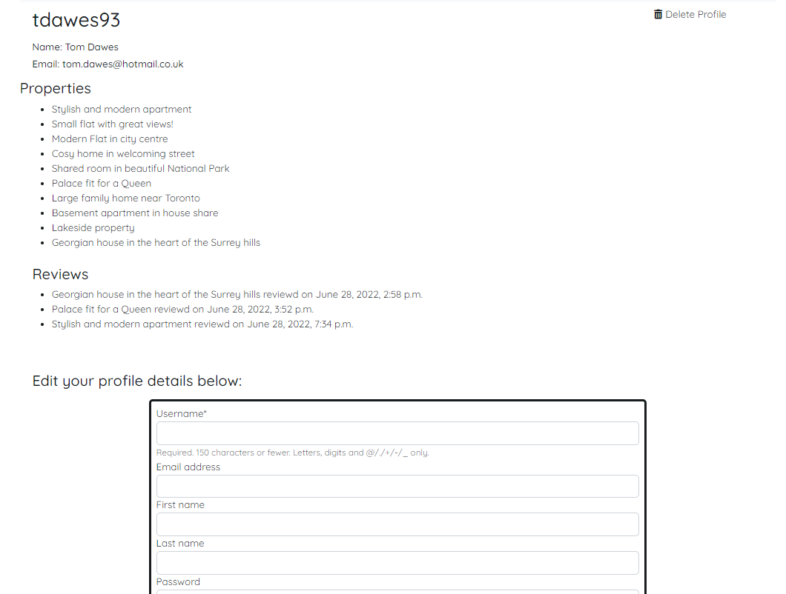

#### Search Page

- If users wish to use the search function on the homepage they can do so by inputting address information and clicking the search icon of pressing Enter
- Additionally users who click to leave a review using the icon in the nav bar are brought to search bar which works in the same way.
- Both search bars bring you to two separate identical pages.
- The pages list all the properties, with useful information, that matched your search criteria. 
- Each property card is a link which will take you to either the property detail page of the add review form. 
- Although the search bar says 'Postcode' it will accept any or all of the address fields, however it is character sensitive so a rogue space at the end will throw the function off. 

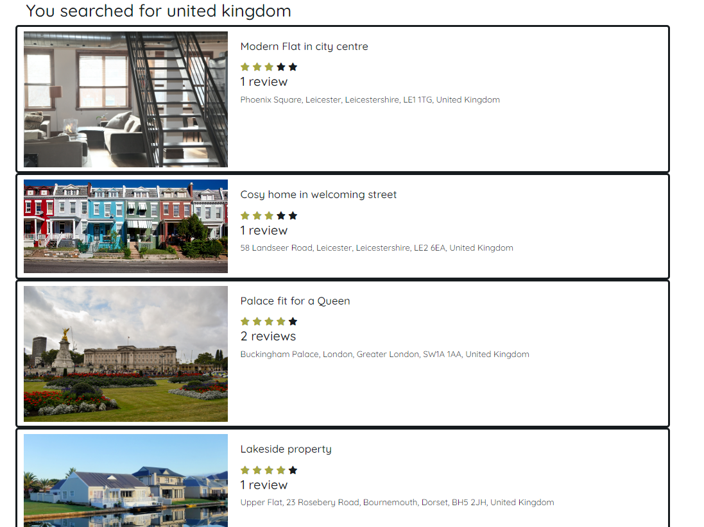

### Future Features to Implement

- In addition to the features not brought across from the backlog to this iteration and those not completed in this iteration some additional features/fixes were identified that could be implemented in the future.

- Key features still in the backlog that could be allocated as Must Haves in the next iteration are as follows:
    - The ability to like a review
    - Improve the profile page including adding a picture. This could then be shown as part of the review in addition to the username.
    - As part of improving the profile page the property and review lists could be linked to bring the user to the relevant item. There could also be an edit and delete button available so the user has a central location where they can perform admin tasks for their profile. 
    - The integratation of the map feature should be at the forefront of the next iteration. It could be a static map indicating the location of the property or it could be an interactive map highlighting all property locations stored on RatemyRoom
    - An additional card could be added on the property detail page highlighting properties with similar details or locations.
- Some less important user stories that could be integrated if the time allowed are:
    -  Approve reviews/comments
    - Direct messaging between users
    - Followers and the ability to follow other users
    - A recent activity section/ability to save a property of interest.

***

## Technologies

### Languages
- The project was written using the Django Framework in Python 3.8.11
- The Database used was PostgreSQL hosted on Heroku
- The Front End Design was written in HTML5 and styled mainly using the Bootstrap 5 framework.
- A small CSS and Javascript (containing JQuery) file were added for customisation and functionality.
- Front End page logic and rendering was completed using the Django Template tags within the HTML files

### Tools    
- Gitpod was used as an online IDE
- Github was used as the repository for the source code
- Heroku was used as the platform to run the deployed app
-
- PEP8 checker was used to check the Python code for errors
- W3C validator was used to check the HTML code for errors
- Jigsaw was used to check the CSS code for errors
- JSHint was used to check the Javascript code for errors

***

## Testing

### Overview

Testing will be performed on the functionality of the app. This is the key aspect of the appliction. Secondary to this is the front end desing and strong UX. Testing of Django built in features is not needed as the framework tests these for us and provides their own validation tools.  

Testing will look for the following:

- The views, urls and models work as expected rendering the correct pages with no broken links
- All inputs are checked and validated to ensure the user does not input invalid data types. Errors will be raised and an opportunity to try again will be allowed following invalid data entry.
- Users cannot access pages/areas of the website they do not have permissions for. If they come across a page outside of their authorisation an error message will be thrown.
- Responsive design works throughout maintaining readability and ease of use with no unexpected changes/overlaps
- All code will be passed through an acceptable validator for the language. 

### Validator Testing

- Python
    - The official PEP8 online syntax checker came back with no issues. 

- HTML
    - The official W3C online syntax checker came back with 3 instances of the following issues. They were resolved using the suggested fixes in the checker. Other issues raised were due to the implementation of Django Template Tags clashing with the rules of the checker, as per the image below.

    

- CSS
    - The official Jigsaw online syntax checker came back with no issues.

- Javascript 
    - The official JSHint online syntax checker cam back with no issues. 

### Issues/Bugs resolved during development 

- The carousel on index.html was pulling all property data entries and laying them ontop of one another. The JS was then freezing after 3 or 4 slides, and users were unable to move on. This was fixed by integrating an if loop to ensure the only first property of the for loop was displayed until the carousel nav buttons were used.

- Whilst developing the add-review page an error came back saying object had not item property.title. This was originally put into the code to allow the form to auto-populate the property field, on behalf of the user. This error was fixed by defining the context data and returning it using the following code. 
    
- > def get_context_data(self, *args, **kwargs):
        context = super().get_context_data(**kwargs)
        slug = self.request.GET.get("slug")
        queryset = Property.objects.filter(status=1)
        property = get_object_or_404(queryset, slug=slug)
        context['property'] = property
        return context

- This removed the original error but then raised new error regarding stating the slug was already defined and could not overwrite it. It was decided there was no need for a slug for each review so it was removed from reviews model. This removed all errors.

- The address field for the Property model orginally used the external django-address package. This required a Google Maps API which did not integrate correctly so it was decided to remove it and have separat Charfields for each line of the addresss. Once this change was made in the model and migrations ran the dependancies no longer matched up in the migrations. An attempted fix of changing and removing migrations, increase the error. The bug was resolved by duplicating the new properties app, delete the old one, delete all migrations and migrate again.

- Midway through design a custom user model was made, as other models with a User FK had already been made this also threw an error due to mis-matching migrations. The fix was to drop the database and re-migrate, as this was in development this was not an issue. 

#### Pre-release testing

Manual testing was conducted prior to the first release when the development had been completed, below are the bugs and fixes. 

It was found that registration of a new user didn't automatically sign people in upon completion of the form. This was fixed by adding a validation method to the Class based view

-> 
    def form_valid(self, form):
        to_return = super().form_valid(form)
        user = authenticate(
            username=form.cleaned_data["username"],
            password=form.cleaned_data["password1"],
        )
        login(self.request, user)
        return to_return 

Ratings not capped at 5

Styling issues on phone

### Testing User Goals

- The user goals listed in the User Goal section were tested to ensure the project outcomes were met and the app has good real-world use.  

1. To make a booking for a specific day and input the number of guests required for the booking.
    - Upon running the app select option 1 which allows the user to make a booking Monday - Sunday of up to 10 people
2. To save this booking and it to add to the total number of people booked in that day. 
    - Within option 1, the user has the option to save their booking, which adds the booking to the last row in the bookings worksheet
3. To view the total number of people booked in on any given day in the week.
    - Select option 2 in the main menu and a dictionary in the form {day: number of people booked} will be printed to the terminal for all days of the week
4. To be able to see how many staff are required for the number of people booked.
    - After running the app, select option 3 in the main menu. This choice will calculate the minimum number of staff required per day and print it in another dictionary in the form {day: number of staff needed}.
5. To be able to reset the bookings and start again each week.
    - Option 3 automatically resets the bookings back to 0 whilst calculating the number of staff needed. It gives the user the choice if they wish to proceed, in case it was pressed accidentally.
    - The user can then restart the app with a new week and input new bookings

***

## Deployment 

### Deploy to Heroku

Please deploy the app to Heroku using the following steps:

1. Log into Heroku and click the 'New' button and then "Create new app" from the drop-down list
2. Name your app (it must be unique) and select the region you are based in
3. Select settings and scroll down to the config vars section
4. Wi
5. Add another config var of PORT (key) 8000 (value) to ensure the mock terminal works.
6. S
7. In the connect to Github section, add the repository name to link the Github.
8. Press deploy to deploy the app to Heroku, you can also opt in to "Enable Automatic Deploys" which updates the Heroku every time a new change is pushed to Github.

### Fork the GitHub

If you wish to view or make changes without affecting the original repository you can 'fork the repository'. This creates a copy to your GitHub and can be done using the following steps:

1. Log in to Github and locate the [RatemyRoom Repository](https://github.com/tdawes93/rate-my-room)
2. At the top right of the repository underneath the notification icon is the 'fork' button
3. Click this button and you should now have a copy of the repository in your Github account

### Make a local clone

1. Log in to Github and locate the [RatemyRoom Repository](https://github.com/tdawes93/rate-my-room)
2. At the top of the repository next to the 'Gitpod' button click the dropdown named 'Code'
3. To clone the repository using HTTPS, make sure HTTPS is selected and copy the link
4. Open the Git Bash
5. Change the working directory to the location you wish the clone to be made
6. Type 'git clone' and paste the copied URL
7. Press 'Enter' and your local clone will be created

***

## Credits

***

## Acknowledgments

I'd like to thank my mentor Spencer Bariball for his support and feedback throughout the project. 